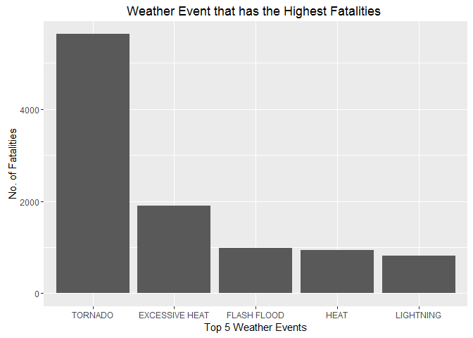
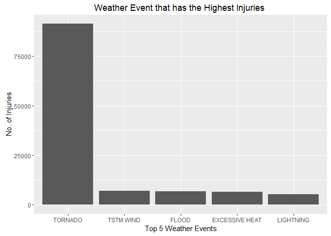
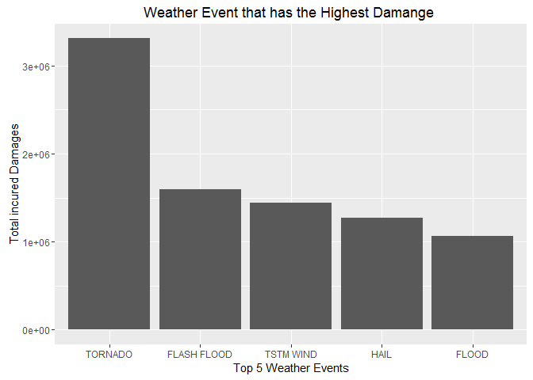

# **Coursera - Reproducible Research Project 2**

### ***Title***
Impact on People and Property due to Severe Weather Across US

### ***Synopsis***
In the following analysis report, we will be investigating which event bring about the greatest impact to people and propoerty in US. This report will bring you through the necessary steps that resulted in the final conclusion as stated below:

Events with the greatest impact ~  
- To People: **TORNADO**  
- To Property: **TORNADO**  

  
### ***Data Processing***

Download data set, reading it into a data frame and give a summary of the raw data.


```r
download.file("https://d396qusza40orc.cloudfront.net/repdata%2Fdata%2FStormData.csv.bz2","FStormData.csv.bz2")
data <- read.csv("FStormData.csv.bz2")
```


#### ***1. Calulation of impact to people***

To find the event with the greatest impact on people, we will be using the sum of the total amount of fatalities that each event caused across the whole set of data for each event. Finally, we will only be extracting the top 5 for the analysis of the final result.


```r
fatal_set <- aggregate(data$FATALITIES, by=list(data$EVTYPE), sum)
names(fatal_set) <- c("EVTYPE", "FATALITIES")
ordered_fatalities <- fatal_set[order(fatal_set$FATALITIES, decreasing = TRUE),]
top_fata <- head(ordered_fatalities, 5)
```


Other than fatalities, it is important to also consider injuries to people as this also impact on the normal daily life of the people. Thus, to properly calculate the value for impact, injuries should theortically also be included in our calculation. 


```r
inj_set <- aggregate(data$INJURIES, by=list(data$EVTYPE), sum)
names(inj_set) <- c("EVTYPE", "INJURIES")
ordered_injuries <- inj_set[order(inj_set$INJURIES, decreasing = TRUE),]
top_inj <- head(ordered_injuries, 5)
```

After this session of data processing, we would have 3 unique data set which is a table that contains fatalities that each event cause, a table that contain injuries that each event cause and lastly a table that contains a sum of fatalities and injuries that each event caused. All this 3 datasets will be use in the final section supplement our conclusion


#### ***2. Calulation of impact to property***
  
For our calculation for impact of property, we will be using figures from both the property damages data and crop damages data. By the end of our calculation, we will have a set of tables containg the top 5 event that does the most combined property and crop damage.


```r
dmg_data <- data[, c("EVTYPE","PROPDMG","CROPDMG")]
dmg_data$total_dmg <- dmg_data$PROPDMG + dmg_data$CROPDMG
event_dmg_data <- aggregate(dmg_data$total_dmg, by=list(dmg_data$EVTYPE),FUN=sum)
names(event_dmg_data) <- c("EVTYPE","TOTAL_DMG")
ordered_event_dmg <- event_dmg_data[order(event_dmg_data$TOTAL_DMG, decreasing = TRUE),]
top_5_dmg <- head(ordered_event_dmg, 5)
```

### ***Results***

Load the necessary library for plotting of results

```r
library(ggplot2)
```

#### ***1. Event that impact people the most***


```r
top_fata$EVTYPE <- ordered(top_fata$EVTYPE, levels=levels(top_fata$EVTYPE)[unclass(top_fata$EVTYPE)])
ggplot(top_fata, aes(x=EVTYPE,y=FATALITIES)) + geom_bar(stat="identity") + xlab("Top 5 Weather Events") + ylab("No. of Fatalities") + ggtitle("Weather Event that has the Highest Fatalities ")
```

<!-- -->

According to the plot Event vs Fatalities chart. We can observe that the event with the highest fatalies is Tornado.


```r
top_inj$EVTYPE <- ordered(top_inj$EVTYPE, levels=levels(top_inj$EVTYPE)[unclass(top_inj$EVTYPE)])
ggplot(top_inj, aes(x=EVTYPE,y=INJURIES)) + geom_bar(stat="identity") + xlab("Top 5 Weather Events") + ylab("No. of Injuries") + ggtitle("Weather Event that has the Highest Injuries ")
```

<!-- -->

Similar to the most deadly weather event, the weather event with the highest injuries is also tornado.

Thus, we can come to a conclusion that the weather event that caused high fatalities and injuries (in another word, impact to people) is **Tornado**.

#### ***2. Event that impact property the most***


```r
top_5_dmg$EVTYPE <- ordered(top_5_dmg$EVTYPE, levels=levels(top_5_dmg$EVTYPE)[unclass(top_5_dmg$EVTYPE)])
ggplot(top_5_dmg, aes(x=EVTYPE,y=TOTAL_DMG)) + geom_bar(stat="identity")+ xlab("Top 5 Weather Events") + ylab("Total incured Damages") + ggtitle("Weather Event that has the Highest Damange ")
```

<!-- -->

With the chart provided above, we conclude that the weather event that causes the most damage to both properties and crops is also **Tornado**.


